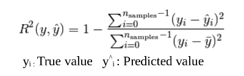
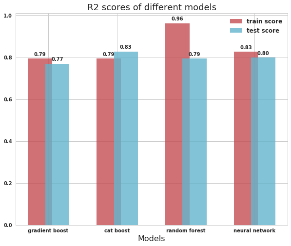

# Github Repo Stars Predictor

## Overview
It's a github repo star predictor that tries to predict the stars of 
any github repository having greater than 100 stars. It predicts based on 
the owner/organization's status and activities (commits, forks, comments, 
branches, update rate, etc.) on the repository. Different types of models 
(Gradient boost, Deep neural network, etc) have been tested successfully 
on the dataset we fetched from github apis.

## Dataset
We used the github REST api and GraphQL api to collect data of repositories
having more than 100 stars. The data is available in the dataset directory
We were able to collect the data faster using the Digital Ocean's multiple 
servers. So we thanks [Digital Ocean](http://digitalocean.com) for providing 
free credits to students to use servers. For the details on dataset features
refer the summary section below.

## Tools used
- Python 2.7
- Jupyter Notebook
- NumPy
- Sklearn
- Pandas
- Keras
- Cat Boost
- Matplot Lib
- seaborn

We also used [Google Colab's](http://colab.research.google.com/) GPU notebooks.
So we thank to Google for starting thier colab project for 
providing GPUs

## code details
Below is a brief description for the Code files/folder in repo.

### Bash script
- **settingUpDOServer.sh**  
filepath: scripts/bash/settingUpDOServer.sh 
This is used for configuring the digital ocean server

### NodeJs scripts
- **getting_repos_v2.js** 
filepath: scripts/nodejs/getting_repos_v2.js 
This script fetches the basic info of repos having more than 100 stars using the Github REST API

- **githubGraphQLApiCallsDO_V2.js** 
filepath: scripts/nodejs/githubGraphQLApiCallsDO_V2.js 
This script fetches the complete info of the repositories that were fetched by the above
script and uses the Github GraphQL API. It follows the approach of fetching the data 
at the fixed rate defined in env file (eg. 730ms per request)

- **githubGraphQLApiCallsDO_V3.js** 
filepath: scripts/nodejs/githubGraphQLApiCallsDO_V3.js 
This script fetches the complete info of the repositories that were fetched by the above
script and uses the Github GraphQL API. It follows the approach of requesting data for 
next repo after receiving the response of the already sent request.

### python scripts
- **json_to_csv.py** 
filepath: scripts/python/json_to_csv.py 
This script converts the json data fetched from Github's GraphQL API in the above script to the
equivalent csv file.

- **merge.py** 
filepath: scripts/python/merge.py 
This scripts merges all the data in multiple csv files to a single csv file

### Jupyter Notebooks
- **VisualizePreprocess.ipynb** 
filepath: notebooks/VisualizePreprocess.ipynb 
We have done the feature engineering task in this notebook. It visualises the data and correspondingly 
creates new features, modifies existing features and removes redundant features. For details 
on features created, check the summary below

- **training_models.ipynb** 
filepath: notebooks/training_models.ipynb 
In this notebook, we trained different models with hyper parameter tuning on our dataset and compared their result in the end.
For details on models trained, their prediction scores, etc. check the summary below.

## Summary
In this project we have tried to predict the number of stars 
of a github repository that have more than 100 stars. For this we have
taken the github repository data from github REST api and GraphQL api. 
After generating the dataset we visulaized and did some feature engineering 
with the dataset and after that , finally we come up to the stage where we 
applied various models and predicted the model's scores on training and 
test data.

### Feature Engineering
There are total of 49 features before pre-processing. After pre-processing (adding new features, removal of redundant features and
modifying existing features) the count changes to 54. All the features are listed below.
Some features after pre-processing may not be clear. Please refer to the VisualizePreprocess.ipynb notebook for details. 

#### Original Features
Row 1 | Row 2 | Row 3
------------ | ------------- | -------------
branches | commits | createdAt 
description | diskUsage | followers 
following | forkCount | gistComments 
gistStar | gists | hasWikiEnabled 
iClosedComments | iClosedParticipants | iOpenComments 
iOpenParticipants | isArchived | issuesClosed
issuesOpen | license | location 
login | members | organizations 
prClosed | prClosedComments | prClosedCommits
prMerged | prMergedComments | prMergedCommits 
prOpen | prOpenComments | prOpenCommits
primaryLanguage | pushedAt | readmeCharCount 
readmeLinkCount | readmeSize | readmeWordCount 
releases | reponame | repositories
siteAdmin | stars | subscribersCount 
tags | type | updatedAt 
websiteUrl |

#### Features after pre-processing
Row 1 | Row 2 | Row 3
------------ | ------------- | -------------
branches | commits | createdAt 
diskUsage | followers | following
forkCount | gistComments | gistStar
gists | hasWikiEnabled | iClosedComments
iClosedParticipants | iOpenComments | iOpenParticipants
issuesClosed | issuesOpen | members
organizations | prClosed | prClosedComments
prClosedCommits | prMerged | prMergedComments
prMergedCommits | prOpen | prOpenComments
prOpenCommits | pushedAt | readmeCharCount
readmeLinkCount | readmeSize | readmeWordCount
releases | repositories | subscribersCount
tags | type | updatedAt
websiteUrl | desWordCount | desCharCount
mit_license | nan_license | apache_license
other_license | remain_license | JavaScript
Python | Java | Objective
Ruby | PHP | other_language

### Models Trained
- **Gradient Boost Regressor**
- **Cat Boost Regressor**
- **Random Forest Regressor**
- **Deep Neural Network**

### Evaluation Metrics
- **R^2 score** 

### Results

